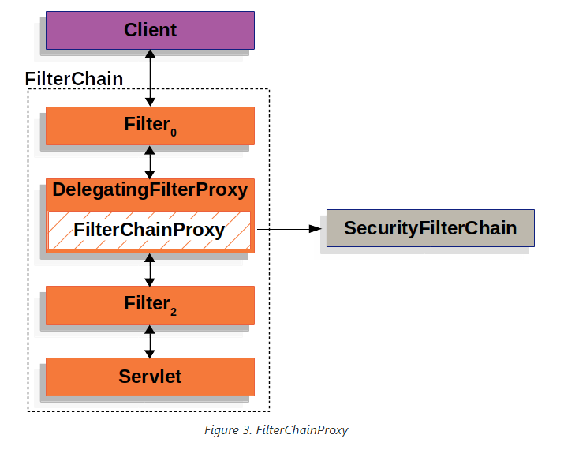

# Spring Security

Spring Security is a framework that provides [authentication](https://docs.spring.io/spring-security/reference/6.3/features/authentication/index.html), [authorization](https://docs.spring.io/spring-security/reference/6.3/features/authorization/index.html), and [protection against common attacks](https://docs.spring.io/spring-security/reference/6.3/features/exploits/index.html). With first class support for securing both [imperative](https://docs.spring.io/spring-security/reference/6.3/servlet/index.html) and [reactive](https://docs.spring.io/spring-security/reference/6.3/reactive/index.html) applications, it is the de-facto standard for securing Spring-based applications.

> SpringSecurity 是一个提供身份验证、授权和防止常见攻击的框架。通过对保护命令式和反应式应用程序的一流支持，它成为保护基于 Spring 的应用程序的事实标准。

官网：https://spring.io/projects/spring-security

## Getting Started

链接：https://docs.spring.io/spring-security/reference/servlet/getting-started.html

**更新依赖项**

首先需要将 SpringSecurity 添加到应用程序的类路径中；有两种方法可以实现这一点： 使用 Maven 或 Gradle。

```java
<dependency>
    <groupId>org.springframework.boot</groupId>
    <artifactId>spring-boot-starter-security</artifactId>
</dependency>
```

在类路径上启用了 Spring Security 后，您现在可以运行 Spring Boot 应用程序了。以下片段显示了一些输出，表明您的应用程序中已启用 Spring Security:

```bash
$ ./mvnw spring-boot:run
...
INFO 23689 --- [  restartedMain] .s.s.UserDetailsServiceAutoConfiguration :

Using generated security password: 8e557245-73e2-4286-969a-ff57fe326336

...
```

现在您已经运行了它，您可以尝试命中一个端点，看看会发生什么。如果您在没有凭据的情况下访问端点，如下所示：

```bash
$ curl -i http://localhost:8080/some/path
HTTP/1.1 401
...
```

那么 Spring Security 拒绝使用未经授权的 401 访问。

>如果您在浏览器中提供相同的 URL，它将重定向到默认登录页面。

使用凭证进行查询

```java
$ curl -i -u user:8e557245-73e2-4286-969a-ff57fe326336 http://localhost:8080/some/path
HTTP/1.1 404
...
```

然后 Spring Boot 将为请求提供服务，在这种情况下返回一个 404 Not Found，因为 /some/path 不存在。


*Spring Boot Security Auto Configuration*

```java
@EnableWebSecurity
@Configuration
public class DefaultSecurityConfig {
    @Bean
    @ConditionalOnMissingBean(UserDetailsService.class)
    InMemoryUserDetailsManager inMemoryUserDetailsManager() {
        String generatedPassword = // ...;
        return new InMemoryUserDetailsManager(User.withUsername("user")
                .password(generatedPassword).roles("USER").build());
    }

    @Bean
    @ConditionalOnMissingBean(AuthenticationEventPublisher.class)
    DefaultAuthenticationEventPublisher defaultAuthenticationEventPublisher(ApplicationEventPublisher delegate) {
        return new DefaultAuthenticationEventPublisher(delegate);
    }
}
```

1. Adds the `@EnableWebSecurity` annotation. (Among other things, this publishes [Spring Security’s default `Filter` chain](https://docs.spring.io/spring-security/reference/servlet/architecture.html#servlet-securityfilterchain) as a `@Bean`)
2. Publishes a [`UserDetailsService`](https://docs.spring.io/spring-security/reference/servlet/authentication/passwords/user-details-service.html) `@Bean` with a username of `user` and a randomly generated password that is logged to the console
3. Publishes an [`AuthenticationEventPublisher`](https://docs.spring.io/spring-security/reference/servlet/authentication/events.html) `@Bean` for publishing authentication events

>Spring Boot 将任何发布为 @Bean 的 Filter 添加到应用程序的筛选器链中。这意味着结合使用 @EnableWebSecurity 和 Spring Boot 会自动为每个请求注册 Spring Security 的过滤器链。

## Architecture

链接：https://docs.spring.io/spring-security/reference/servlet/architecture.html

讨论基于 Servlet 的应用程序中 Spring Security 的高级体系结构。我们将在参考文献的身份验证、授权和防止利用部分中构建这种高层次的理解。

### **A Review of Filters**

Spring Security’s Servlet support is based on Servlet Filters, so it is helpful to look at the role of Filters generally first. The following image shows the typical layering of the handlers for a single HTTP request.


客户机向应用程序发送一个请求，容器创建一个 FilterChain，其中包含 Filter 实例和 Servlet，它们应该根据请求 URI 的路径处理 HttpServletRequest。在 Spring MVC 应用程序中，Servlet 是 DispatcherServlet 的一个实例。一个 Servlet 最多只能处理一个 HttpServletRequest 和 HttpServletResponse。但是，可以使用多个过滤器：

- 防止下游过滤器实例或 Servlet 被调用。在这种情况下，Filter 通常会写入 HttpServletResponse。
- 修改下游过滤器实例和 Servlet 使用的 HttpServletRequest 或 HttpServletResponse。

过滤器的力量来自于传递给它的过滤器链。

```java
public void doFilter(ServletRequest request, ServletResponse response, FilterChain chain) {
	// do something before the rest of the application
    chain.doFilter(request, response); // invoke the rest of the application
    // do something after the rest of the application
}
```

由于 Filter 只影响下游 Filter 实例和 Servlet，因此调用每个 Filter 的顺序非常重要。

### DelegatingFilterProxy

Spring提供了一个名为`DelegatingFilterProxy`的Filter的实现，它在Servlet容器的声明周期和Spring的ApplicationContext之间建立桥梁。Servlet容器允许使用自己的标准注册Filter实例，但他不知道Spring定义的Bean信息，您可以通过标准的 Servlet 容器机制注册 DelegatingFilterProxy，但是将所有工作委托给实现 Filter 的 Spring Bean。


DelegatingFilterProxy 从 ApplicationContext 中查找 Bean Filter0, 然后调用 Bean Filter0。以下代码清单显示了 DeleatingFilterProxy 的伪代码：

```java
public void doFilter(ServletRequest request, ServletResponse response, FilterChain chain) {
	Filter delegate = getFilterBean(someBeanName);
	delegate.doFilter(request, response);
}
```

- 懒加载获取注册为SpringBean的Filter。因为代理中是BeanFilter的一个实例
- 将工作委托给Spring Bean

DelegatingFilterProxy的另一个好处就是允许延迟查找Filter Bean实例。这点很重要，因为容器在启动之前需要注册Filter实例。然而Spring通常使用ContextLoaderListener来加载SpringBeans，这一操作只要在Filter实例需要注册之后才会完成。

### **FilterChainProxy**

Spring Security 的 Servlet 支持包含在 FilterChainProxy 中。FilterChainProxy 是 Spring Security 提供的一个特殊 Filter, 允许通过 SecurityFilterChain 委托给多个 Filter 实例。由于 FilterChainProxy 是一个 Bean, 它通常被包装在 DeleatingFilterProxy 中。



### **SecurityFilterChain**

[`SecurityFilterChain`](https://docs.spring.io/spring-security/reference/api/java/org/springframework/security/web/SecurityFilterChain.html) is used by [FilterChainProxy](https://docs.spring.io/spring-security/reference/servlet/architecture.html#servlet-filterchainproxy) to determine which Spring Security `Filter` instances should be invoked for the current request.


### Security Filters

## Authentication

### Username/Password Authentication

链接：https://docs.spring.io/spring-security/reference/servlet/authentication/passwords/index.html

**配置类方式**

```java
@Configuration
@EnableWebSecurity
public class SecurityConfig {

	@Bean
	public SecurityFilterChain securityFilterChain(HttpSecurity http) throws Exception {
		http
			.authorizeHttpRequests((authorize) -> authorize
				.anyRequest().authenticated()
			)
			.httpBasic(Customizer.withDefaults())
			.formLogin(Customizer.withDefaults());

		return http.build();
	}

	@Bean
	public UserDetailsService userDetailsService() {
		UserDetails userDetails = User.withDefaultPasswordEncoder()
			.username("user")
			.password("password")
			.roles("USER")
			.build();

		return new InMemoryUserDetailsManager(userDetails);
	}

}
```

**yml方式**

```yaml
spring:
  security:
    user:
      name: root
      password: root
```

To learn more about username/password authentication, consider the following use cases:

- I want to [learn how Form Login works](https://docs.spring.io/spring-security/reference/servlet/authentication/passwords/form.html)
- I want to [learn how HTTP Basic authentication works](https://docs.spring.io/spring-security/reference/servlet/authentication/passwords/basic.html)
- I want to [learn how `DaoAuthenticationProvider` works](https://docs.spring.io/spring-security/reference/servlet/authentication/passwords/dao-authentication-provider.html)
- I want to [manage users in memory](https://docs.spring.io/spring-security/reference/servlet/authentication/passwords/in-memory.html)
- I want to [manage users in a database](https://docs.spring.io/spring-security/reference/servlet/authentication/passwords/jdbc.html)
- I want to [manage users in LDAP](https://docs.spring.io/spring-security/reference/servlet/authentication/passwords/ldap.html#servlet-authentication-ldap-authentication)
- I want to [publish an `AuthenticationManager` bean](https://docs.spring.io/spring-security/reference/servlet/authentication/passwords/index.html#publish-authentication-manager-bean) for custom authentication
- I want to [customize the global `AuthenticationManager`](https://docs.spring.io/spring-security/reference/servlet/authentication/passwords/index.html#customize-global-authentication-manager)

### 数据库登录流程分析

1. 访问http://localhost:8080/...

2. 被spring security的filter过滤器拦截（里面有15个Filter）

3. 由于没有登录过，所以spring security就跳转到登录页面（框架生成的）

4. 我们在登录页输出账号和密码去登录提交；（账号和密码是数据库的账号密码）

5. spring security里面的UsernamePasswordAuthenticationFilter接收账号和密码

   ```java
   public class UsernamePasswordAuthenticationFilter extends AbstractAuthenticationProcessingFilter {
       // ....
       @Override
   	public Authentication attemptAuthentication(HttpServletRequest request, HttpServletResponse response)
   			throws AuthenticationException {
   		if (this.postOnly && !request.getMethod().equals("POST")) {
   			throw new AuthenticationServiceException("Authentication method not supported: " + request.getMethod());
   		}
   		String username = obtainUsername(request);
   		username = (username != null) ? username.trim() : "";
   		String password = obtainPassword(request);
   		password = (password != null) ? password : "";
   		UsernamePasswordAuthenticationToken authRequest = UsernamePasswordAuthenticationToken.unauthenticated(username,
   				password);
   		// Allow subclasses to set the "details" property
   		setDetails(request, authRequest);
   		return this.getAuthenticationManager().authenticate(authRequest);
   	}
       // ....
   }
   ```

   6. UsernamePasswordAuthenticationFilter的过滤器会调用loadUserByUsername(String username)方法去数据库查询用户

   7. 从数据库查询用户后，把用户组装成UserDetail对象，然后返回给SpringSecurity框架

   8. 接收到user对象后会经过Filter里面进行用户状态的判断，用户对象中默认有4个状态字段，如果这4个状态字段的值都为true，该用户才能登录，否则就是提示用户状态不正常（框架中实际上只判断3个状态值，那个密码是否过期没有做判断）

      ```java
      this.preAuthenticationChecks.check(user);
      ```

      ```java
      private class DefaultPreAuthenticationChecks implements UserDetailsChecker {
              private DefaultPreAuthenticationChecks() {
              }
      
              public void check(UserDetails user) {
                  if (!user.isAccountNonLocked()) {
                      AbstractUserDetailsAuthenticationProvider.this.logger.debug("Failed to authenticate ...");
                      throw new LockedException(AbstractUserDetailsAuthenticationProvider.this.messages.getMessage("AbstractUserDetailsA..."));
                  } else if (!user.isEnabled()) {
                      AbstractUserDetailsAuthenticationProvider.this.logger.debug("Failed to authenticate ...");
                      throw new DisabledException(AbstractUserDetailsAuthenticationProvider.this.messages.getMessage("AbstractUserDetails...));
                  } else if (!user.isAccountNonExpired()) {
                      AbstractUserDetailsAuthenticationProvider.this.logger.debug("Failed to authenticate since ...");
                      throw new AccountExpiredException(AbstractUserDetailsAuthenticationProvider.this.messages.getMessage("AbstractUserDetailsA..."));
                  }
              }
          }
      ```

   9. 密码比较

      ```java
      protected void additionalAuthenticationChecks(UserDetails userDetails, UsernamePasswordAuthenticationToken authentication) throws AuthenticationException {
          if (authentication.getCredentials() == null) {
              this.logger.debug("Failed to authenticate since no credentials provided");
              throw new BadCredentialsException(this.messages.getMessage("AbstractUserDetailsAuthentication..."));
          } else {
              String presentedPassword = authentication.getCredentials().toString();
              if (!this.passwordEncoder.matches(presentedPassword, userDetails.getPassword())) {
                  this.logger.debug("Failed to authenticate since password does not match stored value");
                  throw new BadCredentialsException(this.messages.getMessage("AbstractUserDetailsAuthentication..."));
              }
          }
      }
      ```

      

